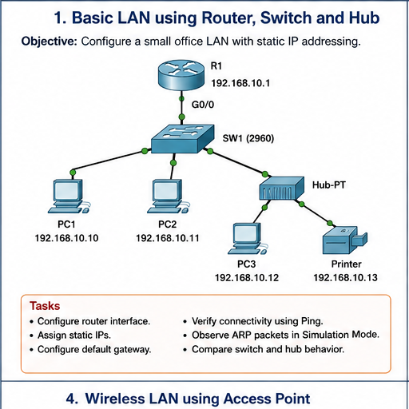

# Question 01: Basic LAN using Router, Switch and Hub

## Question

Configure a small office LAN with static IP addressing. Configure the router interface, assign static IPs, configure default gateway, verify connectivity using ping, observe ARP packets in Simulation Mode, and compare switch and hub behavior.



## IP Addressing Table

| Device | Interface | IP Address | Subnet Mask | Default Gateway |
| --- | --- | --- | --- | --- |
| R1 | G0/0 | `192.168.10.1` | `255.255.255.0` | Not required |
| PC1 | Fa0 | `192.168.10.10` | `255.255.255.0` | `192.168.10.1` |
| PC2 | Fa0 | `192.168.10.11` | `255.255.255.0` | `192.168.10.1` |
| PC3 | Fa0 | `192.168.10.12` | `255.255.255.0` | `192.168.10.1` |
| Printer | Fa0 | `192.168.10.13` | `255.255.255.0` | `192.168.10.1` |

## Router Configuration

```text
enable
configure terminal
hostname R1
interface gigabitEthernet0/0
ip address 192.168.10.1 255.255.255.0
no shutdown
end
write memory
```

## Verification

From PC1:

```text
ping 192.168.10.1
ping 192.168.10.11
ping 192.168.10.12
ping 192.168.10.13
```

Expected result: all pings should succeed. The first ping may fail once because ARP resolution happens first.

## Answers

1. The router interface is configured so all LAN hosts have a default gateway.
2. Static IPs are assigned manually because this lab does not use DHCP.
3. The default gateway for all PCs is `192.168.10.1`.
4. ARP maps an IP address to a MAC address inside the LAN.
5. A switch forwards frames based on learned MAC addresses.
6. A hub repeats traffic to all ports, so it is less efficient than a switch.
7. Use `show ip interface brief` to verify router interface status.

