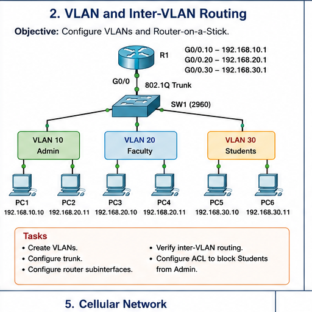

# Question 02: VLAN and Inter-VLAN Routing

## Question

Configure VLANs and Router-on-a-Stick. Create VLANs, configure trunking, configure router subinterfaces, verify inter-VLAN routing, and configure an ACL to block Students from Admin.



## VLAN and IP Plan

| VLAN | Name | PCs | Network | Gateway |
| --- | --- | --- | --- | --- |
| 10 | Admin | PC1, PC2 | `192.168.10.0/24` | `192.168.10.1` |
| 20 | Faculty | PC3, PC4 | `192.168.20.0/24` | `192.168.20.1` |
| 30 | Students | PC5, PC6 | `192.168.30.0/24` | `192.168.30.1` |

## Switch Configuration

```text
enable
configure terminal
vlan 10
name Admin
vlan 20
name Faculty
vlan 30
name Students

interface range fa0/1-2
switchport mode access
switchport access vlan 10

interface range fa0/3-4
switchport mode access
switchport access vlan 20

interface range fa0/5-6
switchport mode access
switchport access vlan 30

interface gigabitEthernet0/1
switchport mode trunk
end
write memory
```

Adjust port numbers based on your actual Packet Tracer connections.

## Router Configuration

```text
enable
configure terminal
interface gigabitEthernet0/0
no shutdown

interface gigabitEthernet0/0.10
encapsulation dot1Q 10
ip address 192.168.10.1 255.255.255.0

interface gigabitEthernet0/0.20
encapsulation dot1Q 20
ip address 192.168.20.1 255.255.255.0

interface gigabitEthernet0/0.30
encapsulation dot1Q 30
ip address 192.168.30.1 255.255.255.0
end
write memory
```

## Student-to-Admin Block ACL

```text
configure terminal
access-list 100 deny ip 192.168.30.0 0.0.0.255 192.168.10.0 0.0.0.255
access-list 100 permit ip any any
interface gigabitEthernet0/0.30
ip access-group 100 in
end
```

## Verification

- `show vlan brief`
- `show interfaces trunk`
- `show ip interface brief`
- Ping between VLANs.
- Confirm Student VLAN cannot ping Admin VLAN after ACL.

## Answers

1. VLANs divide one switch into multiple logical LANs.
2. A trunk carries traffic from multiple VLANs using 802.1Q tags.
3. Router-on-a-Stick uses router subinterfaces for inter-VLAN routing.
4. Each VLAN needs its own default gateway.
5. ACLs filter traffic based on source, destination, and protocol.

