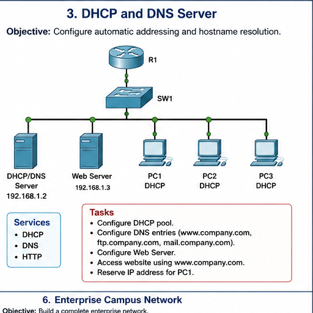

# Question 03: DHCP and DNS Server

## Question

Configure automatic addressing and hostname resolution. Configure DHCP pool, DNS entries, web server, website access using `www.company.com`, and reserve an IP address for PC1.



## Addressing Plan

| Device | IP Address | Purpose |
| --- | --- | --- |
| Router R1 | `192.168.1.1` | Gateway |
| DHCP/DNS Server | `192.168.1.2` | DHCP and DNS |
| Web Server | `192.168.1.3` | HTTP website |
| PC1 | DHCP reservation | Client |
| PC2 | DHCP | Client |
| PC3 | DHCP | Client |

## DHCP Server Settings

On DHCP/DNS Server:

- Static IP: `192.168.1.2`
- Subnet mask: `255.255.255.0`
- Default gateway: `192.168.1.1`
- DNS server: `192.168.1.2`

DHCP pool:

| Field | Value |
| --- | --- |
| Pool name | `LAN_POOL` |
| Default gateway | `192.168.1.1` |
| DNS server | `192.168.1.2` |
| Start IP | `192.168.1.10` |
| Subnet mask | `255.255.255.0` |
| Maximum users | As required |

## DNS Entries

| Name | Address |
| --- | --- |
| `www.company.com` | `192.168.1.3` |
| `ftp.company.com` | `192.168.1.3` |
| `mail.company.com` | `192.168.1.3` |

## Verification

From PC1/PC2/PC3:

```text
ipconfig
ping 192.168.1.1
ping www.company.com
```

Open Web Browser and visit:

```text
http://www.company.com
```

## Answers

1. DHCP automatically assigns IP settings to clients.
2. DNS converts hostnames like `www.company.com` into IP addresses.
3. The web server IP is `192.168.1.3`.
4. PC clients should use DHCP mode.
5. A DHCP reservation gives the same IP address to a specific client every time.

