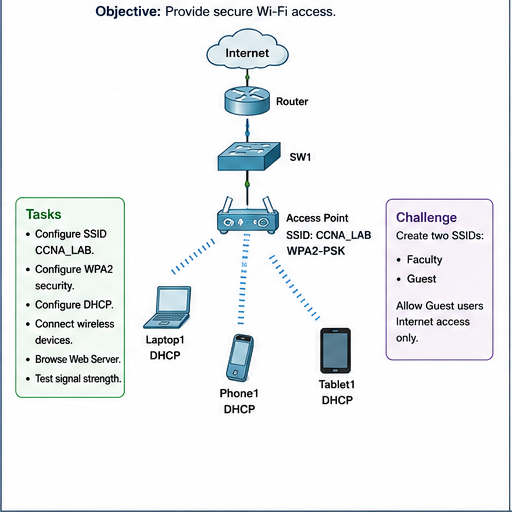

# Question 04: Wireless LAN using Access Point

## Question

Configure secure Wi-Fi access. Configure SSID `CCNA_LAB`, WPA2 security, DHCP, wireless devices, web access, and signal strength testing. Challenge: create Faculty and Guest SSIDs and allow Guest users Internet access only.

## Main Configuration

Access Point:

| Setting | Value |
| --- | --- |
| SSID | `CCNA_LAB` |
| Security | WPA2-PSK |
| Passphrase | Choose a lab password |

Wireless clients:

1. Open laptop/phone/tablet wireless settings.
2. Select SSID `CCNA_LAB`.
3. Enter WPA2 passphrase.
4. Set IP configuration to DHCP.

## Verification

- Confirm wireless clients receive DHCP addresses.
- Ping the default gateway.
- Browse the web server.
- Check wireless signal strength in Packet Tracer.

## Challenge Answer

Create two SSIDs:

| SSID | Users | Access |
| --- | --- | --- |
| `Faculty` | Faculty devices | Internal network and Internet |
| `Guest` | Guest devices | Internet only |

Guest restrictions can be implemented with VLAN separation and ACL rules.

## Answers

1. An access point connects wireless clients to the wired LAN.
2. SSID is the wireless network name.
3. WPA2-PSK secures Wi-Fi using a shared password.
4. DHCP gives IP addresses automatically to wireless clients.
5. Guest Wi-Fi should be isolated from internal LAN resources.

