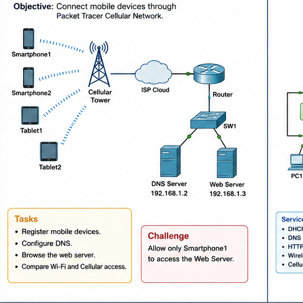

# Question 05: Cellular Network

## Question

Connect mobile devices through Packet Tracer Cellular Network. Register mobile devices, configure DNS, browse the web server, compare Wi-Fi and cellular access, and allow only Smartphone1 to access the web server.

## Addressing Plan

| Device | IP Address |
| --- | --- |
| DNS Server | `192.168.1.2` |
| Web Server | `192.168.1.3` |

## Main Tasks

1. Place smartphones/tablets near the cellular tower.
2. Register mobile devices with the cellular network.
3. Configure DNS so the web server name resolves correctly.
4. Open browser from mobile device and access the web server.
5. Compare Wi-Fi access and cellular access.

## Challenge Answer

To allow only Smartphone1 to access the web server:

1. Identify Smartphone1 IP address.
2. Permit Smartphone1 to reach `192.168.1.3`.
3. Deny other mobile device IPs from reaching `192.168.1.3`.
4. Permit other required traffic if needed.

## Answers

1. Cellular network allows mobile devices to connect without Wi-Fi.
2. DNS is required if users access the web server by name instead of IP.
3. The web server address is `192.168.1.3`.
4. Wi-Fi uses an access point; cellular uses the cellular tower/network.
5. ACLs can restrict only Smartphone1 to the web server.

