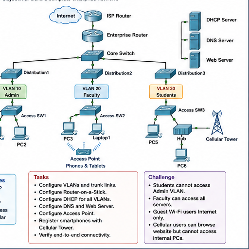

# Question 06: Enterprise Campus Network

## Question

Build a complete enterprise campus network. Configure VLANs and trunk links, Router-on-a-Stick, DHCP for all VLANs, DNS and web server, access point, smartphone registration with cellular tower, and end-to-end connectivity. Apply challenge restrictions.

## VLAN Plan

| VLAN | Name | Users |
| --- | --- | --- |
| 10 | Admin | Admin PCs |
| 20 | Faculty | Faculty PCs and laptops |
| 30 | Students | Student PCs |

## Services

| Service | Purpose |
| --- | --- |
| DHCP | Automatic IP addressing |
| DNS | Hostname resolution |
| HTTP | Website access |
| Wireless | Wi-Fi users |
| Cellular | Mobile users |

## Main Tasks

1. Configure VLANs on switches.
2. Configure trunk links between switches and router.
3. Configure router subinterfaces for VLAN gateways.
4. Configure DHCP pools for each VLAN.
5. Configure DNS entry for the web server.
6. Configure access point for wireless users.
7. Register smartphones with the cellular tower.
8. Verify end-to-end connectivity.

## Challenge Rules and Answers

| Requirement | Solution |
| --- | --- |
| Students cannot access Admin VLAN | Apply ACL denying Student VLAN to Admin VLAN |
| Faculty can access all servers | Permit Faculty VLAN to server network |
| Guest Wi-Fi users get Internet only | Put Guest Wi-Fi in separate VLAN and block internal networks |
| Cellular users can browse website but cannot access internal PCs | Permit HTTP/DNS to servers and deny internal PC subnets |

## Answers

1. Enterprise campus networks use layered switching, VLANs, routing, services, wireless, and security rules.
2. VLANs separate departments logically.
3. Trunks carry multiple VLANs between network devices.
4. Router-on-a-Stick allows inter-VLAN routing using one physical router interface.
5. DHCP reduces manual IP configuration.
6. DNS allows users to access servers using names.
7. ACLs enforce department and guest access restrictions.

